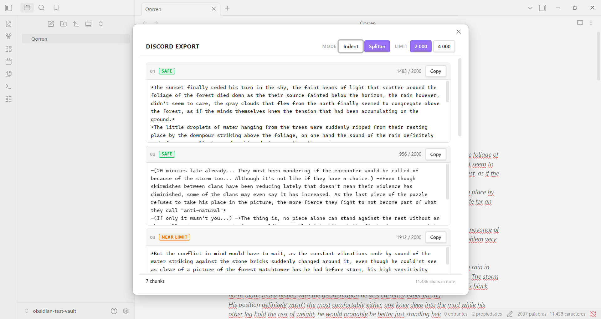
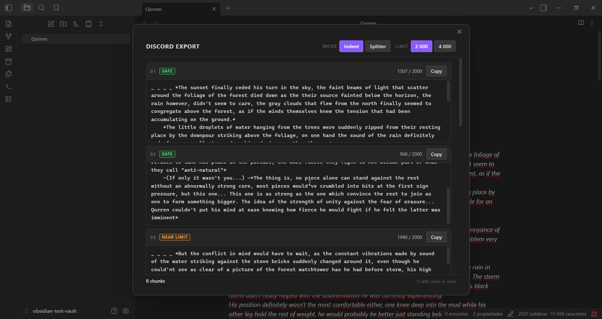

# Discord Export

An Obsidian plugin that prepares your notes for posting on Discord.

This is mainly a personal tool. I write a lot in Obsidian and regularly share that text on Discord. Manually splitting long notes to fit Discord's message limits and in some cases, formatting oddities, got kinda annoying the moment I start doing it with long text. 
This plugin is made to automate that in a (what I hope is) simple way.


---

## What it does

When you trigger the command, a modal opens showing your note split into numbered chunks that fit within Discord's character limit. Each chunk has its own **Copy** button to paste the chunks needed into discord one by one.

I use a lot of indentation in the things I write, but sometimes discord handles them weirdly, so the plugin has an indentation mode where it just straight up converts line jumps into indents that discord can handle.



---

## Features

- **Automatic splitting** — chunks your note at paragraph boundaries
- **Indent mode** — adds Discord-compatible indentation to every paragraph (see below)
- **Splitter mode** — splits only, no indentation added
- **2000 / 4000 character limit** — toggle between standard and Nitro limits
- **Ignore blocks** — wrap content in `{...}` to strip it from the output
- **Breakpoints** — force a chunk split at any point with `+++`



---

## Usage

Open the note you want to export, then run **Discord Export: Export note to Discord** from the command palette (`Ctrl+P`). You can assign a hotkey in **Settings → Hotkeys**.

The modal will show all chunks ready to copy.

---

## Special syntax

### Ignore blocks `{...}`

Wrap anything in curly braces and it will be stripped from the output entirely.

```
He looked serious, his eyes fixed on the horizon.
{add character portrait here}
—We leave at dawn. —he said, turning away.
```

Output:
```
He looked serious, his eyes fixed on the horizon.
—We leave at dawn. —he said, turning away.
```

Ignore blocks can span multiple lines:

```
The village burned through the night.
{
  insert map image here
  reference: scene-3-map.png
}
By morning, nothing remained.
```

### Breakpoints `+++`

Place `+++` on its own line to force a new chunk to start at that point, regardless of how full the current chunk is. Think of it like `<br>` in HTML — it's a one-way split marker

```
He looked serious, his eyes fixed on the horizon.
—We leave at dawn. —he said, turning away.

+++

The village burned through the night.
```

This produces two chunks: everything before the `+++` and everything after, this is to have a way control text separation if needed.

---

## Settings

| Setting | Options | Default |
|---------|---------|---------|
| Character limit | 2000 / 4000 (Nitro) | 2000 |
| Default mode | Indent / Splitter | Indent |

Both settings can also be overridden per session directly inside the modal.

---

## License

MIT — see [LICENSE](LICENSE)
